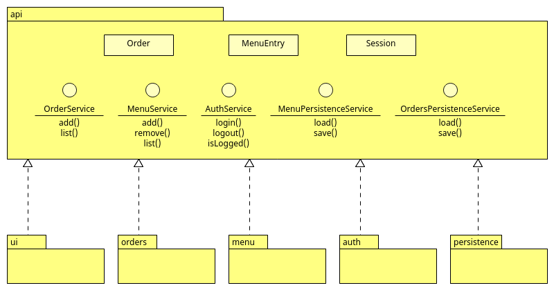

# Esercizio Mensa

## Introduzione

Questa esercitazione ha l'obiettivo di mostrare come scomporre un'applicazione in parti, facendo uso delle interfacce.
Inoltre, contestualmente si vogliono introdurre alcuni nuovi concetti come i `record`, le _collezioni_ e i metodi per
I/O su file.
Infine, l'esercizio vuole essere utilizzato come base di partenza per introdurre alcuni elementi di base dell'ingegneria
del software, come i principi SOLID, la gestione delle dipendenze e alcuni semplici _Design Pattern_. 

## Descrizione API



L'idea è quella di realizzare insieme l'API, in cui si descrive il comportamento dell'applicazione e poi suddividere il
lavoro di implementazione in gruppi, ciascuno responsabile di un modulo.

### AuthenticationService
Servizio che permette di effettuare login e logout e verificare se una sessione è attiva.

`MenuEntry` è un `record`, ossia una classe **immutabile**, che non può essere modificata durante l'esecuzione.

Il codice:
```java
package it.avbo.mensa.api;

public record MenuEntry(String name, int kcal) {

    @Override
    public String toString() {
        return name + ", kcal=" + kcal;
    }
}
```

è esattamente corrispondente (equivalente) al seguente:
```java
package it.avbo.mensa.api;

import java.util.Objects;

public final class MenuEntry {
    private final String name;
    private final int kcal;

    public MenuEntry(String name, int kcal) {
        this.name = name;
        this.kcal = kcal;
    }

    @Override
    public String toString() {
        return name + ", kcal=" + kcal;
    }

    public String name() {
        return name;
    }

    public int kcal() {
        return kcal;
    }

    @Override
    public boolean equals(Object obj) {
        if (obj == this) return true;
        if (obj == null || obj.getClass() != this.getClass()) return false;
        var that = (MenuEntry) obj;
        return Objects.equals(this.name, that.name) &&
                this.kcal == that.kcal;
    }

    @Override
    public int hashCode() {
        return Objects.hash(name, kcal);
    }

}
```

Osserviamo come i campi privati siano `final` (ossia non-riassegnabili/modificabili), dando quindi luogo ad una
classe le cui istanze sono immutabili.
Grazie alla keyword `record`, il compilatore produce automaticamente una classe con campi `final`, in cui sono
dichiarati e implementati i corrispondenti metodi getter (i setter non ha senso siano previsti, dato che i campi
non possono essere modificati).
Inoltre, il compilatore ridefinisce automaticamente i metodi `equals()` e `hashCode()`, per permettere un corretto
utilizzo dei record con le collezioni.

### MenuService
Servizio che permette di aggiungere, eliminare ed elencare tutte le "pietanze" disponibili nella mensa

### OrderingService
Servizio che permette di effettuare un ordine dal menu ed elencare tutti gli ordini pervenuti al servizio mensa

### PersistenceService
Servizio che inoltra le richieste di salvataggio e caricamento di menu e ordini ai corrispondenti servizi specializzati
Secondo i principi SOLID, in particolare il Single Responsibility Principle (SRP) e l'Interface Segregation Principle (IRP)
non è una buona pratica mantenere un'interfaccia `PersistenceService` che include la definizione di funzionalità relative
a responsabilità differenti: la persistenza degli ordini e la persistenza del menu.

Conviene pertanto scomporre l'interfaccia in due interfacce più "piccole", ciascuna che definisce il comportamento per
una specifica funzionalità da implementare.

#### MenuPersistenceService
Servizio che permette di salvare e caricare il menu con tutte le "pietanze" disponibili nella mensa

#### OrdersPersistenceService
Servizio che permette di salvare e caricare gli ordini pervenuti al servizio mensa